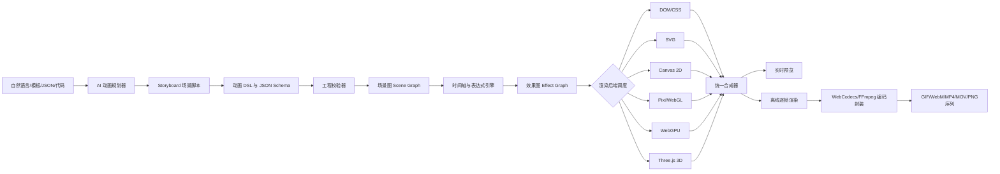
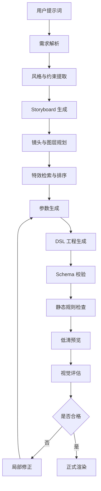

# AI 代码动画与 AE 类特效引擎  
## 任务开发需求说明书

> 文档类型：产品需求 + 技术架构 + 函数库规划 + 前端编辑器设计 + 测试验收规范  
> 建议项目代号：**CodeMotion FX Engine**  
> 文档版本：V1.0  
> 适用对象：产品经理、前端工程师、图形渲染工程师、后端工程师、算法工程师、测试工程师、AI 应用工程师  
> 核心目标：通过代码、结构化参数和 AI 指令生成具有 AE 观感的动画与特殊效果，并形成可扩展的特效函数引擎及可视化前端编辑页面。

---

# 1. 项目背景

传统 AE 动效制作依赖设计师手工建立图层、关键帧、遮罩、表达式、粒子、摄像机和后期效果。该工作方式具有以下问题：

1. 制作成本高，重复性工作多。
2. 同类动画难以批量生产。
3. 难以由大语言模型稳定调用。
4. 动效参数缺乏统一的数据结构。
5. 动画逻辑、视觉效果和导出流程通常耦合在具体工程文件中。
6. 无法方便地作为 API、函数、模板或自动化工作流复用。
7. HTML/CSS 只能覆盖部分界面动效，无法完整表达粒子、复杂合成、三维、镜头、物理模拟、Shader 和高质量视频后期效果。

本项目需要开发一套“代码驱动的 AE 类动画与特殊效果引擎”。每一种特殊效果均以独立函数、插件或效果节点存在，通过统一的 JSON Schema、时间轴系统、图层系统和渲染后端执行。用户既可以在前端页面中手工调节，也可以输入自然语言，由 AI 自动规划场景、选择特效、生成参数、组合时间轴并输出动画。

本项目不是简单建设一个 CSS 动画库，也不是复制 AE 的全部功能，而是建立一套适合 AI 调用、批量生成、自动渲染和二次开发的代码动画基础设施。

---

# 2. 项目定位

## 2.1 产品定位

本系统定位为：

- 代码驱动的动态图形生成引擎；
- 面向 AI 的动画 DSL 与特效函数库；
- 具备图层、时间轴、关键帧、效果栈、遮罩、合成、粒子、三维和后处理能力的在线编辑器；
- 可批量生成短视频包装、产品宣传动画、数据动画、文字动画、UI 演示动画、品牌片头、转场和特殊视觉效果；
- 可作为独立 Web 应用，也可作为 SDK、CLI、服务端渲染服务或内部函数库使用。

## 2.2 与 AE 的关系

本项目追求的是“AE 类能力模型”，包括：

- 图层与父子层级；
- 时间轴与关键帧；
- 缓动与表达式；
- 遮罩、蒙版、轨道遮罩；
- 混合模式；
- 预合成；
- 2D/2.5D/3D 场景；
- 粒子与程序化效果；
- 摄像机、灯光和景深；
- 效果栈与后期处理；
- 视频、图片、文字、矢量、音频等多媒体资产；
- 可重复、可参数化、可导出的动画工程。

V1 不要求直接读写 `.aep` 工程文件，也不要求百分之百复制 AE 插件生态。后续可以增加 Lottie、Rive、SVG、视频序列以及 AE 脚本/表达式的导入导出适配器。

---

# 3. 总体目标

## 3.1 核心目标

1. 建立统一的动画工程数据模型。
2. 建立不少于 120 个特效函数的分类函数库。
3. 每个特效必须具有独立 ID、参数 Schema、默认值、预览缩略图、性能等级、渲染后端和降级策略。
4. 建立图层、时间轴、关键帧、缓动、表达式、父子关系和预合成能力。
5. 建立 Canvas、SVG、WebGL/WebGPU、Three.js 和离线视频渲染的多后端架构。
6. 建立完整的前端可视化动画编辑器。
7. 建立 AI 动画生成链路，使 AI 能根据自然语言生成结构化工程，而不是直接拼接不受控代码。
8. 支持图片序列、GIF、WebM、MP4 和透明背景视频等导出方案。
9. 支持浏览器实时预览与服务端高质量离线渲染。
10. 形成插件化结构，后续可以持续增加特效函数，而不修改引擎核心。

## 3.2 非目标

以下内容不作为 V1 强制目标：

- 完整替代专业剪辑软件；
- 完整实现 AE 所有内置效果；
- 完整兼容所有浏览器的同等 GPU 表现；
- 在浏览器内完成所有高分辨率、长时长视频编码；
- 允许 AI 直接运行不受限制的 JavaScript、Python 或系统命令；
- 实现影视级流体、烟雾和刚体仿真的全部精度；
- 直接兼容所有第三方 AE 插件。

---

# 4. 典型使用场景

## 4.1 AI 自动生成动画

用户输入：

> 生成一个 8 秒的科技感片头。黑色背景，中央标题从粒子中聚合出现，随后出现蓝紫色扫描光，镜头轻微推进，结尾标题产生故障闪烁并淡出。

系统应自动完成：

1. 识别时长、比例、风格和主体。
2. 创建场景与图层。
3. 选择粒子聚合、扫描光、摄像机推进、故障闪烁和淡出函数。
4. 生成结构化时间轴。
5. 自动检查效果冲突和性能预算。
6. 实时预览。
7. 根据用户反馈重新生成局部参数。
8. 导出视频。

## 4.2 批量短视频包装

输入标题、图片、品牌色、Logo 和文案列表，系统根据模板批量生成几十或几百条视频。

## 4.3 数据与信息动画

输入 JSON、CSV 或 API 数据，生成柱状图、折线图、数字滚动、路径高亮、节点关系和解释性动画。

## 4.4 产品 UI 演示

导入界面截图、网页录屏或组件结构，生成点击、聚焦、放大、路径指示、文字标注、光标运动和镜头切换动画。

## 4.5 品牌与营销视觉

生成 Logo 演绎、文字片头、液态转场、霓虹发光、金属质感、粒子爆炸、光线穿梭和三维旋转。

## 4.6 特效函数研发与测试

研发人员可在“特效实验室”中单独加载某个函数，调节参数、查看帧耗时、生成基准图和回归测试样本。

---

# 5. 用户角色

| 角色 | 主要目标 | 主要操作 |
|---|---|---|
| 普通创作者 | 快速生成动画 | 选择模板、输入提示词、替换素材、导出 |
| 视觉设计师 | 精细控制画面 | 调节图层、关键帧、遮罩、效果参数 |
| 开发人员 | 调用动画能力 | 使用 SDK、CLI、API 或 JSON DSL |
| 特效研发人员 | 增加新效果 | 实现插件接口、Shader、参数面板和测试 |
| AI 应用人员 | 建立自动生成链路 | 提示词解析、效果检索、结构化生成、纠错 |
| 管理员 | 管理函数与资源 | 上架特效、版本控制、权限、用量和渲染队列 |

---

# 6. 核心设计原则

## 6.1 Schema 驱动

所有效果、图层、关键帧、素材、导出参数和前端表单均由 Schema 驱动，禁止为每个特效手工硬编码一套独立页面。

## 6.2 特效函数原子化

一个函数只负责一种清晰的视觉能力。例如：

- `fx.text.typewriter`
- `fx.particle.logoAssemble`
- `fx.distort.glitchSlice`
- `fx.light.scanBeam`
- `fx.transition.liquidWipe`

复杂动画通过多个原子函数组合，而不是不断增加不可维护的“大而全函数”。

## 6.3 可组合与可嵌套

每个效果必须支持以下组合方式：

- 串联：前一个效果的输出作为后一个效果输入；
- 并联：多个效果同时作用；
- 图层级效果；
- 组级效果；
- 全局后处理；
- 预合成后再次处理；
- 时间片段内启停；
- 使用遮罩限定影响区域。

## 6.4 确定性渲染

相同工程、相同随机种子、相同引擎版本和相同渲染配置必须得到可复现结果。粒子、噪声和生成式效果必须接受 `seed` 参数。

## 6.5 预览与导出分离

实时预览优先响应速度，可动态降低粒子数量、采样数和分辨率；正式导出必须使用固定时间步长和离线高质量参数。

## 6.6 多后端而非单技术依赖

不同效果选择最合适的渲染后端：

- DOM/CSS：简单界面型动效；
- SVG：路径、矢量、文字轮廓和蒙版；
- Canvas 2D：轻量 2D 绘制；
- WebGL：高性能 2D、粒子、Shader 和后处理；
- WebGPU：计算密集型或高级 GPU 效果的可选后端；
- Three.js：3D、摄像机、灯光和模型；
- 服务端 FFmpeg：视频合成、滤镜、编码、封装和格式转换。

## 6.7 AI 安全生成

AI 默认只生成经过 Schema 校验的 DSL，不直接执行任意代码。高级代码模式必须经过：

- AST 解析；
- API 白名单；
- 资源访问限制；
- Worker 或容器沙箱；
- 超时与内存限制；
- 禁止文件系统和网络任意访问；
- 依赖锁定；
- 输出审计。

---

# 7. 总体系统架构



---

# 8. 技术路线建议

## 8.1 推荐采用“浏览器编辑 + 混合渲染 + 服务端导出”架构

### 前端编辑器

- TypeScript；
- React 或同类组件框架；
- Vite 或同类构建工具；
- 状态管理采用可撤销、可重做的命令模型；
- Web Worker 承担表达式计算、资源预处理、缩略图、波形和部分离屏渲染；
- IndexedDB 用于本地工程缓存和素材索引；
- WebSocket 或 SSE 用于服务端渲染进度。

### 2D 渲染

优先使用 WebGL 作为生产级实时预览后端。可采用 PixiJS 或自研抽象层承载精灵、容器、滤镜、纹理和 RenderTexture。

### 3D 渲染

使用 Three.js 或同类 3D 引擎处理：

- 模型；
- 几何体；
- 材质；
- 灯光；
- 摄像机；
- 后处理；
- 2.5D 图层；
- 文字挤出；
- 粒子空间。

### 高级 GPU 效果

使用 GLSL Shader 作为稳定主线；为 WebGPU/WGSL 建立可选实验后端。必须做能力检测，不得假设所有终端均支持 WebGPU。

### 视频导出

- 浏览器快速导出：WebCodecs + 容器封装库；
- 服务端正式导出：逐帧渲染 + FFmpeg；
- GIF：调色板生成、抖动和帧率控制；
- MP4：H.264/H.265 按部署环境授权与编码器能力选择；
- WebM：VP9/AV1；
- 透明视频：WebM Alpha 或支持 Alpha 的中间格式；
- 高质量工作流：PNG/EXR 序列后再编码。

## 8.2 技术能力分层

| 层级 | 技术 | 适用效果 | 备注 |
|---|---|---|---|
| L0 | DOM/CSS | 简单文字、UI、布局过渡 | 易编辑，但合成能力有限 |
| L1 | SVG | 路径、描边、蒙版、矢量形变 | 适合可缩放矢量效果 |
| L2 | Canvas 2D | 轻量绘制、图表、简单粒子 | 上手快，复杂后期较弱 |
| L3 | WebGL | 大规模粒子、滤镜、Shader、纹理 | V1 主力 GPU 后端 |
| L4 | WebGPU | 计算 Shader、高级 GPU 管线 | 作为增强后端，必须可降级 |
| L5 | Three.js | 3D、摄像机、灯光、模型 | 与 2D 合成器统一时间轴 |
| L6 | FFmpeg | 编码、封装、滤镜、视频合成 | 服务端正式输出 |
| L7 | WASM/原生模块 | 重计算、编解码、图像算法 | 按性能需要引入 |

---

# 9. 动画工程数据模型

## 9.1 Project

一个工程至少包含：

```ts
interface MotionProject {
  schemaVersion: string;
  engineVersion: string;
  id: string;
  name: string;
  width: number;
  height: number;
  fps: number;
  duration: number;
  background: BackgroundDefinition;
  colorSpace: "srgb" | "display-p3" | "linear-srgb";
  seed: number;
  assets: AssetDefinition[];
  compositions: CompositionDefinition[];
  fonts: FontDefinition[];
  audioTracks: AudioTrackDefinition[];
  renderPresets: RenderPreset[];
  metadata: Record<string, unknown>;
}
```

## 9.2 Composition

预合成是可复用的子时间轴：

```ts
interface CompositionDefinition {
  id: string;
  name: string;
  width: number;
  height: number;
  duration: number;
  fps?: number;
  layers: LayerDefinition[];
  markers?: TimelineMarker[];
  effects?: EffectInstance[];
}
```

## 9.3 Layer

必须支持以下图层类型：

- TextLayer；
- ShapeLayer；
- ImageLayer；
- VideoLayer；
- AudioLayer；
- SvgLayer；
- CanvasLayer；
- ParticleLayer；
- Model3DLayer；
- CameraLayer；
- LightLayer；
- AdjustmentLayer；
- NullLayer；
- DataLayer；
- CompositionLayer；
- CustomLayer。

统一字段：

```ts
interface LayerDefinition {
  id: string;
  type: string;
  name: string;
  visible: boolean;
  locked: boolean;
  solo: boolean;
  startTime: number;
  endTime: number;
  inPoint: number;
  outPoint: number;
  parentId?: string;
  zIndex: number;
  transform: TransformDefinition;
  opacity: Animatable<number>;
  blendMode: BlendMode;
  masks: MaskDefinition[];
  effects: EffectInstance[];
  source?: AssetReference;
  properties: Record<string, unknown>;
}
```

## 9.4 Animatable

任何可动画参数均使用统一结构：

```ts
type Animatable<T> =
  | { mode: "constant"; value: T }
  | { mode: "keyframes"; keyframes: Keyframe<T>[] }
  | { mode: "expression"; expression: ExpressionDefinition }
  | { mode: "binding"; source: DataBindingDefinition };

interface Keyframe<T> {
  time: number;
  value: T;
  easing?: EasingDefinition;
  interpolation?: "linear" | "hold" | "bezier" | "spring" | "spline";
  inTangent?: number[];
  outTangent?: number[];
}
```

## 9.5 EffectInstance

```ts
interface EffectInstance {
  id: string;
  effectId: string;
  version: string;
  enabled: boolean;
  startTime?: number;
  endTime?: number;
  mix: Animatable<number>;
  maskId?: string;
  params: Record<string, Animatable<unknown> | unknown>;
  renderQuality?: "draft" | "preview" | "final";
  cachePolicy?: "none" | "frame" | "range" | "static";
}
```

---

# 10. 特效函数统一规范

每一个特效函数必须有独立的 `EffectDefinition`：

```ts
interface EffectDefinition {
  effectId: string;
  version: string;
  displayName: string;
  category: string;
  description: string;
  tags: string[];
  inputTypes: string[];
  outputType: string;
  parameterSchema: JsonSchema;
  uiSchema: EffectUISchema;
  defaultPreset: Record<string, unknown>;
  renderBackends: RenderBackend[];
  preferredBackend: RenderBackend;
  fallbackBackend?: RenderBackend;
  deterministic: boolean;
  supportsAlpha: boolean;
  supportsMask: boolean;
  supportsKeyframes: boolean;
  supportsExpressions: boolean;
  performanceClass: "light" | "medium" | "heavy" | "extreme";
  qualityLevels: QualityLevelDefinition[];
  validationRules: ValidationRule[];
  migrationHandlers: MigrationHandler[];
  render: EffectRenderFunction;
  dispose: () => void;
}
```

## 10.1 函数命名规则

统一格式：

```text
fx.<一级分类>.<效果名称>
```

示例：

```text
fx.text.typewriter
fx.light.neonGlow
fx.particle.logoAssemble
fx.distort.glitchSlice
fx.transition.liquidWipe
fx.camera.dollyZoom
```

## 10.2 函数输入

每个函数至少接受：

```ts
interface EffectRenderContext {
  time: number;
  deltaTime: number;
  frame: number;
  fps: number;
  width: number;
  height: number;
  seed: number;
  quality: "draft" | "preview" | "final";
  inputTextures: TextureHandle[];
  params: Record<string, unknown>;
  mask?: TextureHandle;
  audio?: AudioAnalysisFrame;
  data?: Record<string, unknown>;
  renderer: RendererAdapter;
}
```

## 10.3 函数输出

输出必须是以下一种：

- 可继续合成的纹理；
- SVG 节点或矢量路径；
- 图层变换结果；
- 粒子缓冲区；
- 3D 场景节点；
- 音频分析数据；
- 中间帧；
- 元数据或检测结果。

禁止函数直接操作全局页面状态。

## 10.4 参数约束

每个参数必须定义：

- 类型；
- 默认值；
- 最小值；
- 最大值；
- 步长；
- 单位；
- 是否可关键帧；
- 是否可表达式；
- 是否支持随机化；
- UI 控件；
- 性能影响；
- 参数冲突；
- 空值行为；
- 版本迁移方式。

---

# 11. 特效函数库规划

以下为首版完整函数目录，共 15 类、120 个核心函数。每一个函数均须提供独立 Demo、参数 Schema、前端面板、预设、单元测试和视觉回归样本。

---

## 11.1 基础运动与入场类

| ID | 函数名 | 作用 | 关键参数 |
|---|---|---|---|
| M01 | `fx.motion.fade` | 淡入、淡出或透明度脉冲 | from、to、duration、easing |
| M02 | `fx.motion.slide` | 从任意方向滑入或滑出 | direction、distance、overshoot |
| M03 | `fx.motion.scalePop` | 缩放弹入、弹出 | startScale、endScale、spring |
| M04 | `fx.motion.rotateIn` | 旋转进入 | angle、pivot、blur |
| M05 | `fx.motion.bounce` | 弹跳运动 | height、gravity、bounces |
| M06 | `fx.motion.elastic` | 弹性位移或缩放 | amplitude、period、decay |
| M07 | `fx.motion.float` | 周期漂浮 | axis、range、frequency、phase |
| M08 | `fx.motion.shake` | 震动、冲击、抖动 | intensity、frequency、decay |

验收重点：

- 支持位置、缩放、旋转、锚点和透明度属性；
- 支持方向预设和自定义向量；
- 支持固定随机种子；
- 可用于文字、图片、形状、预合成和 3D 节点。

---

## 11.2 文字与排版动效类

| ID | 函数名 | 作用 | 关键参数 |
|---|---|---|---|
| T01 | `fx.text.typewriter` | 打字机逐字出现 | speed、cursor、wordMode |
| T02 | `fx.text.characterCascade` | 字符级错位、级联出现 | stagger、axis、offset |
| T03 | `fx.text.kineticTypography` | 动态排版组合 | layoutMode、beatMap、scaleMap |
| T04 | `fx.text.textPathReveal` | 沿路径书写或显现 | path、progress、orientation |
| T05 | `fx.text.textMorph` | 两段文字轮廓变形 | sourceText、targetText、matchMode |
| T06 | `fx.text.scrambleDecode` | 乱码解码成目标文字 | charset、speed、lockDirection |
| T07 | `fx.text.wordExplode` | 字符或词语爆散 | force、rotation、depth |
| T08 | `fx.text.textExtrude3D` | 文字挤出与立体旋转 | depth、bevel、material、light |

特殊要求：

- 中文、英文、数字和 Emoji 分词策略可配置；
- 字符、单词、行、段落四级选择器；
- 支持字体缺失检测；
- 支持文本自动换行和安全区；
- 支持字形转路径以获得稳定描边与形变效果；
- AI 生成时必须区分“内容文本”和“装饰字符”。

---

## 11.3 矢量图形与路径类

| ID | 函数名 | 作用 | 关键参数 |
|---|---|---|---|
| V01 | `fx.vector.pathTrim` | 路径描边逐步绘制 | start、end、offset |
| V02 | `fx.vector.pathMorph` | SVG 路径之间形变 | fromPath、toPath、normalize |
| V03 | `fx.vector.shapeRepeater` | 图形重复排列 | count、offset、rotation、scale |
| V04 | `fx.vector.radialBurst` | 放射线、放射图形爆发 | count、radius、angle |
| V05 | `fx.vector.wavePath` | 路径波浪形变 | amplitude、frequency、phase |
| V06 | `fx.vector.dashFlow` | 虚线沿路径流动 | dashArray、speed、direction |
| V07 | `fx.vector.blobMorph` | 有机液态形状变形 | points、noise、tension |
| V08 | `fx.vector.shapeBooleanAnimate` | 布尔图形动态组合 | operation、progress、feather |

要求：

- 路径归一化；
- 不同节点数量的路径需重采样；
- 保留闭合状态和方向；
- 支持填充、描边、渐变、蒙版和裁剪；
- 导出 SVG 时尽量保留矢量；
- 无法保留时降级为序列帧或视频。

---

## 11.4 描边、书写与手绘类

| ID | 函数名 | 作用 | 关键参数 |
|---|---|---|---|
| D01 | `fx.draw.handwriting` | 模拟手写笔迹 | path、pressure、speedVariation |
| D02 | `fx.draw.brushReveal` | 笔刷遮罩显现 | brushTexture、size、roughness |
| D03 | `fx.draw.inkSpread` | 墨水扩散 | diffusion、edgeNoise、absorption |
| D04 | `fx.draw.chalkStroke` | 粉笔描边 | grain、scatter、opacity |
| D05 | `fx.draw.markerStroke` | 马克笔涂抹 | width、overlap、bleed |
| D06 | `fx.draw.neonTrace` | 霓虹路径追踪 | glow、trail、pulse |
| D07 | `fx.draw.lightningTrace` | 闪电沿路径传播 | branches、jitter、flicker |
| D08 | `fx.draw.paintOn` | 逐笔绘制图片或 Logo | strokeOrder、brush、coverage |

---

## 11.5 色彩、光线与能量类

| ID | 函数名 | 作用 | 关键参数 |
|---|---|---|---|
| L01 | `fx.light.neonGlow` | 霓虹发光 | color、radius、intensity、flicker |
| L02 | `fx.light.scanBeam` | 扫描光带 | angle、width、softness、speed |
| L03 | `fx.light.lensFlare` | 镜头光晕 | source、ghosts、streak、chromatic |
| L04 | `fx.light.energyPulse` | 能量脉冲波 | center、radius、falloff、rings |
| L05 | `fx.light.volumetricRay` | 体积光束 | density、samples、decay、exposure |
| L06 | `fx.light.electricArc` | 电弧连接 | points、branches、noise、glow |
| L07 | `fx.light.gradientFlow` | 渐变颜色流动 | stops、direction、speed、loop |
| L08 | `fx.light.auraField` | 物体周围动态光场 | contour、layers、noise、pulse |

要求：

- 采用线性色彩空间进行必要的光效计算；
- 支持 HDR 中间缓冲的可选实现；
- 避免多次模糊导致性能失控；
- 允许预览低采样、导出高采样；
- 发光必须支持 Alpha 边缘和遮罩边界。

---

## 11.6 模糊、镜头与后期类

| ID | 函数名 | 作用 | 关键参数 |
|---|---|---|---|
| P01 | `fx.post.gaussianBlur` | 高斯模糊 | radius、passes、edgeMode |
| P02 | `fx.post.directionalBlur` | 定向模糊 | angle、distance、samples |
| P03 | `fx.post.radialBlur` | 径向缩放或旋转模糊 | center、strength、mode |
| P04 | `fx.post.motionBlur` | 基于速度的运动模糊 | shutterAngle、samples、velocity |
| P05 | `fx.post.depthOfField` | 景深 | focusDistance、aperture、maxBlur |
| P06 | `fx.post.chromaticAberration` | 色差 | amount、direction、radial |
| P07 | `fx.post.filmGrain` | 胶片颗粒 | amount、size、colored、seed |
| P08 | `fx.post.colorGrade` | 曲线、色轮、LUT 调色 | lut、exposure、contrast、gamma |

要求：

- 后期效果可作用于单层、组、调整层或全局画面；
- LUT 支持 `.cube` 或内部统一格式；
- 预览和导出保持可接受的颜色一致性；
- 模糊与景深效果需要性能警告。

---

## 11.7 扭曲、故障与数字特效类

| ID | 函数名 | 作用 | 关键参数 |
|---|---|---|---|
| G01 | `fx.distort.glitchSlice` | 横向或纵向切片错位 | slices、offset、seed、frequency |
| G02 | `fx.distort.rgbSplit` | RGB 通道分离 | distance、angle、noise |
| G03 | `fx.distort.pixelSort` | 像素排序 | threshold、direction、segment |
| G04 | `fx.distort.datamosh` | 数据损坏风格运动拖影 | blockSize、flow、decay |
| G05 | `fx.distort.waveWarp` | 正弦波扭曲 | amplitude、frequency、axis |
| G06 | `fx.distort.turbulentDisplace` | 湍流置换 | scale、amount、evolution、seed |
| G07 | `fx.distort.liquidDisplace` | 液态折射与置换 | viscosity、refraction、flowMap |
| G08 | `fx.distort.kaleidoscope` | 万花筒镜像 | segments、rotation、center |

降级原则：

- 不支持高级 Shader 时使用 CPU/Canvas 近似；
- Datamosh 无法精确模拟编码损坏时，使用运动矢量和块状残影近似；
- 像素排序可限制采样尺寸后放大；
- 重型扭曲需支持区域渲染和缓存。

---

## 11.8 粒子与能量特效类

| ID | 函数名 | 作用 | 关键参数 |
|---|---|---|---|
| R01 | `fx.particle.emitter` | 通用粒子发射器 | rate、life、velocity、size、color |
| R02 | `fx.particle.logoAssemble` | 粒子聚合为 Logo/文字 | target、count、attraction、scatter |
| R03 | `fx.particle.dissolve` | 图层粒子化消散 | sampling、force、turbulence |
| R04 | `fx.particle.trail` | 运动拖尾粒子 | source、length、fade、spacing |
| R05 | `fx.particle.spark` | 火花喷射 | cone、gravity、drag、glow |
| R06 | `fx.particle.snowRain` | 雪、雨、尘埃环境粒子 | weatherType、wind、depth、density |
| R07 | `fx.particle.orbitField` | 环绕粒子场 | center、orbits、speed、depth |
| R08 | `fx.particle.flowField` | 流场粒子 | vectorField、noiseScale、curl |

粒子系统要求：

- CPU 与 GPU 两种实现；
- 固定种子；
- 支持粒子发射器形状：点、线、矩形、圆、路径、纹理、模型表面；
- 支持生命周期曲线；
- 支持颜色、尺寸、旋转、透明度和速度随时间变化；
- 支持吸引器、排斥器、涡旋和碰撞；
- 预览自动降低粒子数量；
- 粒子目标采样支持文本、SVG、图片 Alpha 和 3D 顶点。

---

## 11.9 物理与模拟类

| ID | 函数名 | 作用 | 关键参数 |
|---|---|---|---|
| S01 | `fx.sim.spring` | 弹簧跟随 | stiffness、damping、mass |
| S02 | `fx.sim.rigidBody2D` | 2D 刚体运动 | gravity、restitution、friction |
| S03 | `fx.sim.softBody` | 软体形变 | mesh、stiffness、pressure |
| S04 | `fx.sim.cloth` | 布料摆动 | resolution、wind、pins、gravity |
| S05 | `fx.sim.rope` | 绳索或链条 | segments、constraints、drag |
| S06 | `fx.sim.fluidLite` | 轻量二维流体 | viscosity、diffusion、vorticity |
| S07 | `fx.sim.boids` | 群集运动 | cohesion、alignment、separation |
| S08 | `fx.sim.collisionShatter` | 碰撞碎裂 | fractureMap、force、pieces、gravity |

要求：

- 物理系统使用固定时间步长；
- 支持烘焙为关键帧；
- 导出前允许预计算；
- 随机碎裂必须可复现；
- 复杂模拟必须有最大迭代次数和内存保护；
- V1 的流体为视觉近似，不承诺工程仿真精度。

---

## 11.10 转场与显隐类

| ID | 函数名 | 作用 | 关键参数 |
|---|---|---|---|
| C01 | `fx.transition.wipe` | 线性擦除转场 | direction、softness、angle |
| C02 | `fx.transition.radialWipe` | 环形或扇形擦除 | center、startAngle、clockwise |
| C03 | `fx.transition.liquidWipe` | 液态边缘转场 | noise、viscosity、edgeGlow |
| C04 | `fx.transition.pixelDissolve` | 像素块溶解 | grid、order、seed |
| C05 | `fx.transition.pageTurn` | 翻页转场 | corner、curl、shadow |
| C06 | `fx.transition.portal` | 传送门转场 | ring、distortion、depth |
| C07 | `fx.transition.zoomTunnel` | 缩放隧道 | center、speed、motionBlur |
| C08 | `fx.transition.objectMatchCut` | 主体匹配切换 | sourceMask、targetMask、morph |

要求：

- 统一接受 A、B 两个输入；
- 支持转场进度 `progress: 0~1`；
- 支持遮罩和边缘样式；
- 可单独测试第 0、0.25、0.5、0.75、1 进度帧；
- AI 应根据场景语义选择转场，而不是随机堆叠。

---

## 11.11 3D、镜头与空间类

| ID | 函数名 | 作用 | 关键参数 |
|---|---|---|---|
| X01 | `fx.camera.panTilt` | 摄像机平移和摇镜 | pan、tilt、duration |
| X02 | `fx.camera.dolly` | 摄像机推进或拉远 | distance、easing、target |
| X03 | `fx.camera.dollyZoom` | 推拉变焦 | cameraMove、fovCompensation |
| X04 | `fx.camera.orbit` | 环绕主体 | radius、azimuth、elevation |
| X05 | `fx.camera.handheld` | 手持镜头抖动 | amount、frequency、roll |
| X06 | `fx.3d.parallaxLayers` | 多层视差 | depthMap、cameraRange、perspective |
| X07 | `fx.3d.objectExplode` | 3D 模型零件爆炸 | parts、distance、direction、delay |
| X08 | `fx.3d.textLogoReveal` | 三维文字或 Logo 演绎 | extrusion、material、camera、light |

要求：

- 统一世界坐标、摄像机坐标和屏幕坐标转换；
- 2D 图层支持 2.5D 深度；
- 支持透视和正交摄像机；
- 支持环境光、平行光、点光和聚光灯；
- 支持 glTF/GLB；
- 模型导入时进行面数、纹理尺寸和材质检查；
- 3D 与 2D 图层必须共享时间轴。

---

## 11.12 图片、视频与媒体处理类

| ID | 函数名 | 作用 | 关键参数 |
|---|---|---|---|
| I01 | `fx.media.kenBurns` | 图片平移缩放 | startRect、endRect、easing |
| I02 | `fx.media.smartCropAnimate` | 主体跟踪式动态裁切 | subject、safeArea、speed |
| I03 | `fx.media.imageDepthParallax` | 单图深度视差 | depthMap、camera、edgeFill |
| I04 | `fx.media.photoStack` | 照片堆叠与翻动 | count、spread、shadow、order |
| I05 | `fx.media.videoFreezeFrame` | 视频定格并强调 | time、duration、treatment |
| I06 | `fx.media.speedRamp` | 视频变速曲线 | speedCurve、frameBlend |
| I07 | `fx.media.echoTrail` | 视频帧回声拖尾 | samples、interval、fade |
| I08 | `fx.media.backgroundRemoveCompose` | 前景抠像后合成 | matte、spill、edge、background |

要求：

- 资源必须经过预加载和解码状态管理；
- 视频逐帧访问需统一解码接口；
- 跨域素材必须检查可读性；
- 抠像可接入外部模型，但引擎仅消费透明视频、Alpha 蒙版或分割结果；
- 素材代理文件与原文件分离；
- 长视频必须支持时间范围裁剪和按需解码。

---

## 11.13 程序化生成与数学图形类

| ID | 函数名 | 作用 | 关键参数 |
|---|---|---|---|
| A01 | `fx.gen.noiseField` | 生成噪声场 | type、scale、octaves、seed |
| A02 | `fx.gen.fractal` | 分形图案动画 | formula、iterations、zoom、palette |
| A03 | `fx.gen.lSystem` | L-System 生长动画 | axiom、rules、iterations |
| A04 | `fx.gen.voronoi` | Voronoi 单元动画 | points、metric、animateSeeds |
| A05 | `fx.gen.metaballs` | 融合球体 | count、threshold、motion |
| A06 | `fx.gen.spiralTunnel` | 螺旋隧道 | arms、depth、twist、speed |
| A07 | `fx.gen.waveSurface` | 波形曲面 | rows、cols、amplitude、frequency |
| A08 | `fx.gen.sacredGeometry` | 几何纹样生成 | pattern、symmetry、rings、rotation |

要求：

- 所有程序化生成均接受 seed；
- 公式和规则必须经过安全解析；
- 禁止任意 `eval`；
- 生成几何数量必须受限；
- 支持导出矢量或烘焙纹理；
- 支持 AI 根据风格词选择生成器参数。

---

## 11.14 音频、节拍与数据响应类

| ID | 函数名 | 作用 | 关键参数 |
|---|---|---|---|
| U01 | `fx.audio.spectrumBars` | 音频频谱柱 | bands、range、smoothing、layout |
| U02 | `fx.audio.waveform` | 波形动画 | mode、thickness、mirror、color |
| U03 | `fx.audio.beatPulse` | 节拍驱动缩放或发光 | sensitivity、decay、targetProperty |
| U04 | `fx.audio.onsetTrigger` | 音频起音触发特效 | threshold、cooldown、effectRef |
| U05 | `fx.audio.vocalReactiveText` | 人声强度驱动文字 | band、mapping、smoothing |
| U06 | `fx.data.numberCounter` | 数值滚动 | from、to、format、duration |
| U07 | `fx.data.chartReveal` | 图表逐步绘制 | chartType、data、stagger |
| U08 | `fx.data.liveBinding` | 数据字段实时绑定动画 | source、mapping、fallback |

要求：

- 音频分析可预计算并缓存；
- 提供 RMS、峰值、FFT、频段、节拍、起音和节奏标记；
- 实时预览和离线导出必须使用同一分析结果；
- 数据绑定必须定义字段缺失和类型错误策略。

---

## 11.15 合成、遮罩与材质类

| ID | 函数名 | 作用 | 关键参数 |
|---|---|---|---|
| H01 | `fx.composite.maskReveal` | 遮罩显隐 | mask、progress、feather、invert |
| H02 | `fx.composite.trackMatte` | Alpha 或亮度轨道遮罩 | matteLayer、mode、invert |
| H03 | `fx.composite.blend` | 图层混合 | mode、opacity、premultiply |
| H04 | `fx.composite.displacementMap` | 置换贴图 | map、xAmount、yAmount、channel |
| H05 | `fx.composite.textureOverlay` | 纹理叠加 | texture、blendMode、scale、motion |
| H06 | `fx.material.glass` | 玻璃材质 | blur、refraction、tint、border |
| H07 | `fx.material.metal` | 金属材质 | roughness、specular、brushed |
| H08 | `fx.material.hologram` | 全息投影材质 | scanline、flicker、glitch、depth |

要求：

- 明确定义预乘 Alpha；
- 混合模式在不同后端间建立映射表；
- 不支持的混合模式必须采用 Shader 或离线合成；
- 玻璃、折射和置换需要背景纹理输入；
- 遮罩可关键帧化、羽化和反相；
- 轨道遮罩不得破坏原始图层结构。

---

# 12. 特效预设系统

每个函数不仅提供参数，还必须提供预设。预设示例：

```json
{
  "presetId": "preset.neonGlow.cyberBlue",
  "effectId": "fx.light.neonGlow",
  "version": "1.0.0",
  "name": "赛博蓝霓虹",
  "tags": ["科技", "赛博朋克", "标题"],
  "params": {
    "color": "#42C8FF",
    "radius": 28,
    "intensity": 1.8,
    "flicker": 0.12
  },
  "previewAsset": "preview://neonGlow/cyberBlue.webp"
}
```

预设必须支持：

- 内置预设；
- 用户预设；
- 团队共享预设；
- AI 推荐标签；
- 参数随机化；
- 相似预设检索；
- 版本迁移；
- 收藏、搜索、排序和分组；
- 预设封面自动生成。

---

# 13. 时间轴与关键帧系统

## 13.1 时间单位

内部统一使用秒和帧索引：

```text
timeInSeconds = frame / fps
```

正式导出必须使用固定帧时间，不得依赖浏览器实际刷新率。

## 13.2 时间轴能力

必须支持：

- 图层入点、出点；
- 图层裁剪；
- 图层偏移；
- 关键帧；
- 关键帧复制粘贴；
- 多选关键帧；
- 缩放和平移时间轴；
- 标记点；
- 区域循环；
- 时间重映射；
- 变速曲线；
- 预合成嵌套时间；
- 音频波形；
- 节拍标记；
- 表达式驱动；
- 关键帧烘焙；
- 自动吸附；
- 关键帧曲线编辑器；
- 分层折叠。

## 13.3 缓动系统

内置：

- linear；
- easeIn；
- easeOut；
- easeInOut；
- cubicBezier；
- spring；
- bounce；
- elastic；
- back；
- steps；
- customCurve。

缓动函数必须可视化，并允许 AI 选择语义化缓动：

- 柔和；
- 强烈；
- 有重量；
- 机械；
- 弹性；
- 快速响应；
- 缓慢漂浮。

---

# 14. 表达式与绑定系统

## 14.1 表达式能力

目标是实现受控的 AE 表达式替代能力，例如：

```text
wiggle(frequency, amplitude)
loop(type)
valueAtTime(time)
clamp(value, min, max)
map(value, inMin, inMax, outMin, outMax)
spring(target, stiffness, damping)
noise(seed, time)
audio.band(index)
data("sales.total")
layer("Title").position.x
```

## 14.2 安全原则

- 禁止 `eval`；
- 使用自定义解析器或安全 AST；
- 只允许白名单函数；
- 不允许访问 DOM、网络、文件系统、Cookie 和全局对象；
- 设置最大执行步数；
- 检测循环依赖；
- 对表达式结果进行类型校验；
- 表达式错误时回退到上一个合法值，并显示错误。

## 14.3 数据绑定

支持：

- JSON；
- CSV；
- 表单输入；
- 数据库 API 的服务端代理结果；
- 音频分析；
- 时间；
- 场景变量；
- 用户自定义变量；
- AI 生成变量。

---

# 15. 效果图与渲染管线

## 15.1 效果栈

单图层效果按顺序执行：

```text
Source
→ Transform
→ Pre-mask Effects
→ Mask
→ Layer Effects
→ Blend
→ Group Effects
→ Adjustment Layer
→ Global Post-processing
→ Output
```

必须允许用户改变效果顺序。

## 15.2 效果图

复杂合成使用有向无环图：

- 输入节点；
- 纹理节点；
- 颜色节点；
- 数学节点；
- 遮罩节点；
- Shader 节点；
- 合成节点；
- 输出节点。

系统必须检测：

- 环路；
- 输入类型不匹配；
- 尺寸不匹配；
- Alpha 类型不匹配；
- 颜色空间不匹配；
- 过多中间纹理；
- 无用节点；
- 不可达输出。

## 15.3 RenderTexture 池

需要建立纹理池，避免每帧频繁创建销毁 GPU 资源。纹理键可由以下字段构成：

```text
width + height + format + colorSpace + samples + usage
```

---

# 16. 前端页面设计

## 16.1 页面一：项目工作台

功能：

- 新建工程；
- 选择横屏、竖屏、方形和自定义尺寸；
- 选择帧率；
- 最近项目；
- 模板市场；
- AI 一句话生成；
- 导入工程；
- 渲染任务状态；
- 素材库；
- 团队空间。

## 16.2 页面二：动画编辑器

推荐布局：

```text
┌──────────────────────────────────────────────────────────────┐
│ 顶部：项目、撤销、重做、预览、分辨率、性能、导出            │
├──────────────┬───────────────────────────────┬───────────────┤
│ 左侧资源区   │ 中央画布与安全区              │ 右侧属性区    │
│ 图层/素材    │ 选择框、参考线、摄像机视图    │ 变换/效果     │
│ 特效/模板    │                               │ Schema 表单   │
├──────────────┴───────────────────────────────┴───────────────┤
│ 底部时间轴：图层、关键帧、曲线、音频波形、标记               │
└──────────────────────────────────────────────────────────────┘
```

### 顶部工具栏

- 保存状态；
- 撤销、重做；
- 播放、暂停；
- 当前时间；
- 预览质量；
- 分辨率；
- FPS；
- 画布缩放；
- GPU/CPU 状态；
- 导出；
- 分享；
- AI 助手。

### 左侧面板

标签页：

1. 图层；
2. 素材；
3. 文字；
4. 图形；
5. 特效；
6. 转场；
7. 3D；
8. 音频；
9. 数据；
10. 模板；
11. 预合成。

### 中央画布

支持：

- 画布缩放；
- 平移；
- 选择；
- 框选；
- 多选；
- 旋转；
- 缩放；
- 锚点编辑；
- 路径节点编辑；
- 遮罩编辑；
- 3D 操纵器；
- 摄像机视图；
- 安全区；
- 网格；
- 参考线；
- 吸附；
- 透明背景；
- 前后对比；
- 分屏预览；
- 性能降级提示。

### 右侧属性面板

由 Schema 自动生成：

- 基础属性；
- 变换；
- 文本；
- 外观；
- 遮罩；
- 效果栈；
- 材质；
- 3D；
- 表达式；
- 数据绑定；
- 性能；
- 高级参数。

任何可动画字段旁边均显示关键帧开关。

### 底部时间轴

- 图层树；
- 锁定、隐藏、独奏；
- 父子绑定；
- 图层颜色；
- 关键帧；
- 曲线编辑器；
- 音频波形；
- 时间重映射；
- 标记；
- 预览范围；
- 帧级步进；
- 效果区间；
- 嵌套合成。

## 16.3 页面三：特效实验室

每个效果单独调试，包含：

- 效果预览；
- 默认素材；
- 参数面板；
- JSON 输入；
- Shader 编辑器；
- 性能数据；
- 当前后端；
- 纹理数量；
- Draw Call；
- GPU 时间；
- CPU 时间；
- 显存估算；
- 预览质量；
- 导出测试；
- Golden Frame 对比；
- 多浏览器截图；
- 预设保存；
- 单元测试运行。

## 16.4 页面四：AI 动画生成器

界面区域：

1. 提示词输入；
2. 参考图片、视频、Logo 和音频上传；
3. 比例、时长、风格和品牌约束；
4. Storyboard 预览；
5. AI 选择的特效列表；
6. 时间轴草案；
7. 生成日志；
8. 风险和性能提示；
9. 局部重做；
10. 导出或进入高级编辑器。

用户可以说：

- “只重做第 3 秒到第 5 秒的文字动画”；
- “保持结构不变，换成水墨风格”；
- “粒子太多，降低性能消耗”；
- “镜头不要旋转，只轻微推进”；
- “把标题效果替换为金属挤出”。

## 16.5 页面五：渲染中心

- 渲染队列；
- 本地或云端渲染；
- 状态；
- 进度；
- 日志；
- 失败重试；
- 输出格式；
- 视频信息；
- 预计文件大小；
- 帧错误定位；
- 下载；
- 历史版本；
- 渲染机器信息。

## 16.6 页面六：函数与预设管理后台

- 特效函数列表；
- 分类和标签；
- 版本；
- 上架状态；
- 参数 Schema；
- UI Schema；
- 默认预设；
- 缩略图；
- 性能等级；
- 兼容性；
- 测试覆盖率；
- 变更日志；
- 废弃和迁移；
- 权限；
- 使用次数；
- 错误率。

---

# 17. AI 动画生成链路

## 17.1 推荐流程



## 17.2 AI 不应直接生成的内容

默认禁止 AI：

- 任意执行脚本；
- 自行安装依赖；
- 访问系统文件；
- 从未知网址加载脚本；
- 使用无限循环；
- 生成无上限粒子；
- 写入未声明的 Shader 缓冲；
- 绕过 Schema；
- 修改引擎内核。

## 17.3 AI 应生成的中间结构

```json
{
  "intent": "tech_intro",
  "duration": 8,
  "aspectRatio": "16:9",
  "style": ["dark", "futuristic", "blue-purple"],
  "shots": [
    {
      "start": 0,
      "end": 3,
      "description": "粒子聚合形成标题",
      "layers": ["title", "particleField", "background"],
      "effects": [
        {
          "effectId": "fx.particle.logoAssemble",
          "target": "title",
          "params": {
            "count": 18000,
            "scatter": 0.9,
            "attraction": 1.3
          }
        }
      ]
    }
  ]
}
```

## 17.4 特效检索

需要为每个效果建立语义标签，例如：

- 科技；
- 商务；
- 活泼；
- 儿童；
- 复古；
- 未来；
- 水墨；
- 电影；
- 故障；
- 极简；
- 能量；
- 柔和；
- 高级；
- 快节奏；
- 信息解释；
- Logo；
- 标题；
- 转场；
- 背景；
- 装饰。

检索排序应综合：

- 提示词语义匹配；
- 图层类型；
- 时长；
- 性能预算；
- 画面风格；
- 已选效果冲突；
- 输出格式；
- 设备能力；
- 用户历史偏好；
- 模板约束。

---

# 18. 资源与素材系统

## 18.1 支持格式

### 图片

- PNG；
- JPEG；
- WebP；
- AVIF；
- SVG；
- HDR/EXR 作为后续增强。

### 视频

- MP4；
- WebM；
- MOV 由服务端转码；
- GIF；
- 图片序列。

### 音频

- WAV；
- MP3；
- AAC；
- OGG；
- FLAC 由服务端按需转换。

### 3D

- glTF；
- GLB；
- OBJ/FBX 通过导入转换层处理。

### 字体

- WOFF2；
- WOFF；
- TTF；
- OTF；
- 字形轮廓缓存。

## 18.2 资源处理

上传后生成：

- 原文件哈希；
- 代理文件；
- 缩略图；
- 元数据；
- 色彩空间；
- Alpha 信息；
- 时长；
- 分辨率；
- 帧率；
- 音频采样率；
- 3D 面数；
- 纹理尺寸；
- 字体字形覆盖；
- 安全扫描结果。

## 18.3 资源去重

使用内容哈希去重。不同工程引用同一资源时，不重复存储原文件。

---

# 19. 导出与渲染需求

## 19.1 导出格式

| 类型 | 格式 | 用途 |
|---|---|---|
| 静态 | PNG、JPEG、WebP | 封面和单帧 |
| 矢量 | SVG | 可缩放矢量动画的静态结果 |
| 动图 | GIF、Animated WebP | 轻量分享 |
| 视频 | MP4、WebM | 常规视频 |
| 透明视频 | WebM Alpha、支持 Alpha 的中间格式 | 后期合成 |
| 序列帧 | PNG、WebP、EXR | 高质量后期与容错 |
| 工程 | JSON/ZIP | 继续编辑和迁移 |

## 19.2 渲染模式

### 实时预览

- 动态分辨率；
- 动态粒子数量；
- 低采样模糊；
- 关闭部分阴影；
- 缓存静态图层；
- 跳帧而不改变逻辑时间；
- 自动性能提示。

### 离线正式渲染

- 固定时间步长；
- 固定随机种子；
- 完整分辨率；
- 高采样；
- 不跳帧；
- 逐帧错误检查；
- 分段渲染；
- 中断恢复；
- 帧缓存；
- 音视频最终合成。

## 19.3 导出预设

至少内置：

- 1080p 横屏 MP4；
- 1080p 竖屏 MP4；
- 4K 横屏；
- 透明 WebM；
- 高清 GIF；
- 小体积 GIF；
- PNG 序列；
- 社交媒体竖屏；
- 电商商品动图；
- PPT 插入用 GIF；
- 网页背景 WebM。

---

# 20. 性能指标

## 20.1 预览目标

在推荐桌面设备上：

- 1920×1080、30fps 的普通工程可实时预览；
- 轻量工程目标 60fps；
- 50 个普通 2D 图层不应造成明显编辑阻塞；
- 10,000~50,000 个 GPU 粒子按质量档位运行；
- 时间轴拖动后 200ms 内开始反馈；
- 参数调节后 100ms 内出现视觉响应；
- 工程保存采用增量策略；
- 大资源加载不阻塞主线程。

以上为目标值，测试时按设备等级建立基准档案。

## 20.2 性能等级

每个特效必须标记：

- Light：可多实例；
- Medium：建议不超过 5~10 个；
- Heavy：建议少量使用；
- Extreme：仅离线或高端设备。

## 20.3 自动降级

引擎根据性能自动执行：

- 减少粒子；
- 降低纹理分辨率；
- 降低模糊采样；
- 暂停次要后处理；
- 降低阴影质量；
- 使用代理素材；
- 降低 3D 模型细节；
- 降低预览帧率；
- 将静态效果缓存为纹理。

正式导出不得使用未经用户确认的低质量降级。

---

# 21. 缓存策略

缓存类型：

1. 静态图层缓存；
2. 单帧效果缓存；
3. 时间区间缓存；
4. 预合成缓存；
5. 音频分析缓存；
6. 字形轮廓缓存；
7. 模型几何缓存；
8. Shader 编译缓存；
9. 纹理缓存；
10. 导出分段缓存。

缓存失效键必须包含：

- 资源哈希；
- 特效版本；
- 参数哈希；
- 时间范围；
- 分辨率；
- 质量；
- 颜色空间；
- 随机种子；
- 渲染后端。

---

# 22. 插件化开发规范

建议目录：

```text
packages/
  core/
  timeline/
  expression/
  scene-graph/
  renderer-api/
  renderer-canvas/
  renderer-webgl/
  renderer-webgpu/
  renderer-three/
  renderer-svg/
  compositor/
  export-browser/
  export-server/
  ai-planner/
  schema/
  ui-editor/
  ui-effect-lab/
  effects/
    motion/
    text/
    vector/
    draw/
    light/
    post/
    distort/
    particle/
    simulation/
    transition/
    camera3d/
    media/
    generative/
    audio-data/
    composite-material/
```

单个特效插件目录：

```text
effects/light/neon-glow/
  effect.ts
  schema.json
  ui-schema.json
  presets.json
  shader.vert
  shader.frag
  preview.scene.json
  effect.test.ts
  visual.test.ts
  benchmark.ts
  README.md
  CHANGELOG.md
```

---

# 23. 一个特效的完整开发流程

以 `fx.light.neonGlow` 为例：

1. 明确视觉定义；
2. 确定输入类型；
3. 定义参数；
4. 定义参数边界；
5. 定义 WebGL 实现；
6. 定义 Canvas 或离线降级；
7. 定义预览质量档；
8. 定义 Alpha 行为；
9. 定义遮罩行为；
10. 定义颜色空间；
11. 编写 Schema；
12. 由 Schema 生成属性面板；
13. 编写默认预设；
14. 生成封面；
15. 编写单元测试；
16. 编写关键帧测试；
17. 编写 Golden Frame；
18. 进行性能基准；
19. 检查内存释放；
20. 发布版本。

---

# 24. 测试方案

## 24.1 单元测试

覆盖：

- 参数默认值；
- 参数边界；
- 非法参数；
- 插值；
- 关键帧；
- 表达式；
- 随机种子；
- 时间循环；
- 数据类型；
- 版本迁移；
- 资源释放。

## 24.2 视觉回归测试

每个效果至少保存：

- 起始帧；
- 25% 帧；
- 50% 帧；
- 75% 帧；
- 结束帧；
- Alpha 图；
- 极限参数图；
- 遮罩结果；
- 多后端结果。

通过像素差、结构相似度和感知哈希判定变化。允许抗锯齿差异设置合理阈值。

## 24.3 动画连续性测试

检测：

- 帧跳变；
- 不连续速度；
- Alpha 闪烁；
- Shader NaN；
- 粒子爆炸；
- 路径断裂；
- 镜头穿模；
- 时间循环接缝；
- 音画不同步。

## 24.4 确定性测试

同一工程连续渲染三次，关键帧图像哈希应一致或在允许的 GPU 浮点误差范围内一致。

## 24.5 性能测试

记录：

- 平均 FPS；
- 1% Low FPS；
- CPU 时间；
- GPU 时间；
- Draw Calls；
- 纹理数量；
- 显存估算；
- 内存峰值；
- Shader 编译时间；
- 首帧时间；
- 导出倍速；
- 文件大小。

## 24.6 导出测试

组合矩阵：

- 24/25/30/50/60fps；
- 720p/1080p/2K/4K；
- 有无 Alpha；
- 5 秒/30 秒/5 分钟；
- 有无音频；
- 中英文混排；
- 视频素材；
- 3D 模型；
- 大量粒子；
- 多预合成；
- 暂停恢复；
- 失败重试。

## 24.7 浏览器与环境测试

不以“所有浏览器特性一致”为前提，而是建立能力检测和兼容矩阵：

- WebGL 能力；
- WebGPU 能力；
- WebCodecs 能力；
- OffscreenCanvas；
- Worker；
- 硬件编码器；
- 最大纹理尺寸；
- 浮点纹理；
- 多重采样；
- 视频解码格式。

## 24.8 安全测试

- 恶意表达式；
- 超长 JSON；
- 无限嵌套预合成；
- 超大粒子数量；
- 超大图片；
- 压缩炸弹；
- 恶意 SVG；
- Shader 死循环；
- 非法文件；
- 路径穿越；
- 任意网络请求；
- AI 注入指令；
- 资源耗尽；
- 跨租户访问。

---

# 25. 验收标准

## 25.1 引擎验收

- 能加载、保存和迁移动画工程；
- 能建立图层和预合成；
- 能编辑关键帧和缓动；
- 能执行效果栈；
- 能使用遮罩和混合模式；
- 能实时预览；
- 能离线固定帧渲染；
- 能导出至少 PNG 序列、GIF、WebM 和 MP4；
- 同随机种子结果可复现；
- 效果错误不会导致整个编辑器崩溃。

## 25.2 函数库验收

每个函数必须具备：

- 唯一 ID；
- 版本；
- 参数 Schema；
- UI Schema；
- 默认值；
- 至少 3 个预设；
- 使用说明；
- 预览工程；
- Golden Frame；
- 性能等级；
- 降级策略；
- 测试；
- 变更日志。

## 25.3 前端编辑器验收

- 图层操作完整；
- 时间轴可用；
- 属性面板由 Schema 生成；
- 效果可搜索、拖入和排序；
- 参数可关键帧；
- AI 生成结果可继续手工编辑；
- 撤销重做覆盖主要操作；
- 错误信息能定位到图层、特效和参数；
- 渲染进度可见；
- 工程崩溃后可恢复最近自动保存版本。

## 25.4 AI 生成验收

至少完成以下提示词测试集：

- 科技片头；
- 商务数据动画；
- 活泼儿童标题；
- 水墨 Logo；
- 故障转场；
- 产品 UI 演示；
- 音乐频谱；
- 图片故事；
- 三维文字；
- 粒子聚合。

AI 输出必须：

- 通过 Schema；
- 不引用不存在的函数；
- 参数在合法范围；
- 时长不越界；
- 图层引用有效；
- 不出现循环依赖；
- 满足性能预算；
- 可以预览和导出。

---

# 26. 版本分期

## 26.1 P0：引擎骨架与 MVP

建议优先完成 40 个高频效果：

- 基础运动 8；
- 文字 8；
- 矢量与描边 8；
- 光线与后期 8；
- 转场与合成 8。

同时完成：

- Project/Composition/Layer 数据模型；
- 时间轴；
- 关键帧；
- WebGL 主渲染；
- 基础前端编辑器；
- PNG 序列和 MP4 导出；
- AI DSL 初版；
- 特效实验室。

## 26.2 P1：高级二维与粒子

扩展到 80 个效果：

- 粒子；
- 故障；
- 媒体；
- 音频；
- 程序化；
- 遮罩与材质。

增加：

- Worker；
- 缓存；
- 音频分析；
- 浏览器快速导出；
- 渲染队列；
- 视觉回归平台；
- 预设中心。

## 26.3 P2：三维、模拟与完整 120 函数

增加：

- Three.js 场景；
- 摄像机；
- 灯光；
- 模型；
- 物理模拟；
- WebGPU 实验后端；
- 高级 Shader 节点；
- 透明视频；
- 4K 分段渲染；
- AI 局部重做；
- 函数市场和团队共享。

---

# 27. 建议开发里程碑

| 阶段 | 主要内容 | 交付物 |
|---|---|---|
| 阶段 1 | 数据模型、Schema、渲染接口 | 核心包、示例工程 |
| 阶段 2 | 时间轴、图层、变换、关键帧 | 可播放基础动画 |
| 阶段 3 | WebGL 合成、遮罩、效果栈 | 2D 引擎 MVP |
| 阶段 4 | 前端编辑器基础 | 图层、画布、属性、时间轴 |
| 阶段 5 | 首批 40 个效果 | 函数、预设、测试 |
| 阶段 6 | 离线渲染与导出 | PNG、GIF、WebM、MP4 |
| 阶段 7 | AI DSL 与动画规划 | 提示词生成工程 |
| 阶段 8 | 粒子、音频、程序化 | 80 个效果 |
| 阶段 9 | 3D、物理、后处理 | 120 个效果 |
| 阶段 10 | 性能、兼容、稳定性 | 正式发布候选版 |

---

# 28. 研发任务拆分

## 28.1 引擎核心组

- Scene Graph；
- Timeline；
- Keyframe；
- Expression；
- Effect Graph；
- Renderer Adapter；
- Resource Manager；
- Cache；
- Project Serialization；
- Undo/Redo。

## 28.2 图形特效组

- 2D Shader；
- 文字；
- SVG；
- 路径；
- 粒子；
- 模糊；
- 光效；
- 扭曲；
- 合成；
- 材质。

## 28.3 3D 与模拟组

- 3D 场景；
- 模型导入；
- 摄像机；
- 灯光；
- 3D 文字；
- 物理；
- 软体；
- 轻量流体；
- 3D 后处理。

## 28.4 编辑器组

- 工作台；
- 画布；
- 图层；
- 时间轴；
- 属性面板；
- 特效库；
- 预设；
- 素材；
- AI 面板；
- 渲染中心。

## 28.5 导出与基础设施组

- Headless Renderer；
- FFmpeg；
- WebCodecs；
- 队列；
- 分段渲染；
- 缓存；
- 对象存储；
- 日志；
- 监控；
- 失败恢复。

## 28.6 AI 组

- 提示词解析；
- Storyboard；
- 特效检索；
- 参数生成；
- Schema 修复；
- 视觉评估；
- 局部重做；
- 模板学习；
- 安全策略。

## 28.7 测试组

- 单元测试；
- 视觉回归；
- 性能基准；
- 导出矩阵；
- 浏览器兼容；
- 安全；
- 稳定性；
- 长时间运行。

---

# 29. 主要风险与应对

| 风险 | 表现 | 应对 |
|---|---|---|
| 功能范围过大 | 试图一次复制 AE | 分期，先做高频 40 个效果 |
| 多后端不一致 | 同一效果画面差异 | 规定主后端与 Golden Frame |
| WebGPU 兼容性 | 部分环境不可用 | WebGL 主线，能力检测与降级 |
| 浏览器编码限制 | 无法稳定生成目标容器 | 服务端 FFmpeg 正式导出 |
| 粒子和模糊性能高 | 预览卡顿 | 质量档、缓存、Worker、GPU |
| AI 生成错误 | 参数越界、函数不存在 | Schema、函数检索、静态校验 |
| 任意代码风险 | 安全与稳定性问题 | DSL 优先、沙箱、AST 白名单 |
| 字体差异 | 不同机器文字变化 | 字体嵌入、字形路径、字体检查 |
| 随机效果不一致 | 预览与导出不同 | 固定种子和固定时间步 |
| 工程版本升级 | 旧工程无法打开 | Schema 版本和迁移器 |
| Shader 崩溃 | 黑屏或 GPU 重置 | 编译隔离、超时、回退材质 |
| 大工程内存高 | 浏览器崩溃 | 代理、纹理池、分段、资源回收 |

---

# 30. 代码质量要求

- TypeScript 严格模式；
- 核心包不得依赖 UI；
- 渲染后端通过接口解耦；
- 禁止效果函数写入全局变量；
- 所有 GPU 资源必须可释放；
- 所有异步资源具有取消机制；
- 所有外部输入经过 Schema 校验；
- 统一错误码；
- 统一日志；
- 统一性能埋点；
- 统一版本策略；
- 关键包 API 需要文档；
- 每个函数必须有最小可运行示例；
- 禁止在效果函数中写死分辨率、帧率、颜色和素材路径；
- 禁止依赖浏览器刷新率计算正式动画；
- 禁止使用不可控 `Math.random()`，必须使用种子随机数生成器。

---

# 31. 关键技术决策结论

1. **不局限于 HTML/CSS。** HTML/CSS 只作为其中一个轻量后端。
2. **WebGL 为 V1 实时预览主后端。** WebGPU 作为增强与实验能力。
3. **Three.js 负责 3D。** 2D 与 3D 必须共享统一时间轴。
4. **服务端 FFmpeg 负责正式视频输出。** 浏览器 WebCodecs 用于快速导出和低延迟预览输出。
5. **AI 生成 JSON/DSL，而非任意源码。** 这是可控性、稳定性和安全性的关键。
6. **每个特效对应独立函数。** 复杂动画由效果栈和效果图组合。
7. **前端界面由 Schema 自动生成参数面板。** 防止随着函数增加形成大量硬编码。
8. **特效必须自带预设、测试、性能等级和降级策略。**
9. **预览和导出使用同一逻辑时间，但不同质量档。**
10. **随机、噪声、粒子和生成式动画必须确定性可复现。**

---

# 32. 最终交付清单

## 32.1 文档

- 产品需求说明书；
- 系统架构说明；
- 动画 DSL 规范；
- JSON Schema；
- 特效函数开发规范；
- Shader 开发规范；
- 前端交互说明；
- 导出规范；
- 安全规范；
- 测试规范；
- API 文档；
- 部署文档。

## 32.2 代码

- 核心引擎；
- 多渲染后端；
- 时间轴；
- 表达式；
- 场景图；
- 效果图；
- 120 个特效函数；
- 前端编辑器；
- 特效实验室；
- AI 生成器；
- 浏览器导出；
- 服务端渲染；
- CLI；
- SDK；
- 示例项目。

## 32.3 测试资产

- 每个效果的测试工程；
- Golden Frame；
- 性能基准；
- 导出样例；
- 多分辨率样例；
- 多帧率样例；
- 错误案例；
- 安全测试样本。

---

# 33. 参考技术依据

本方案的关键技术判断基于以下公开技术文档：

- MDN WebGPU API：WebGPU 提供现代 GPU 绘制与通用计算能力，但应进行兼容性检测。
- MDN OffscreenCanvas：可在 Worker 等场景中执行离屏 Canvas 渲染。
- MDN WebCodecs API：可在浏览器中以较低层级访问视频帧并调用编码器/解码器，但容器封装仍需单独处理。
- FFmpeg 官方文档：提供视频转码、滤镜图、音视频合成、编码和封装能力。
- PixiJS 官方文档：提供 WebGL/WebGPU 的高性能 2D 渲染结构。
- Three.js 官方文档：提供 WebGL/WebGPU 渲染器、场景、材质、摄像机和后处理能力。
- Motion Canvas 官方文档：展示了以 TypeScript、生成器和实时编辑器构建代码动画的可行模式。
- W3C Web Animations 与 SVG 规范：提供时间模型、路径、变换、遮罩、滤镜和矢量动画相关标准基础。
- Rive 官方文档：展示了状态机驱动的交互动画模型，可作为后续交互动画适配参考。

---

# 34. 结语

该项目的真正核心并不是“收集一批动画代码”，而是建立统一的动画语言、函数协议、时间系统、渲染管线和编辑器，使任何新的视觉效果都能以插件方式加入，并能被 AI 稳定发现、组合、校验和渲染。

建议严格按照“引擎骨架 → 高频 40 效果 → 前端编辑器 → 导出 → AI DSL → 80 效果 → 3D/模拟 → 120 效果”的顺序推进，避免一开始同时研发所有高级效果而导致架构失控。
